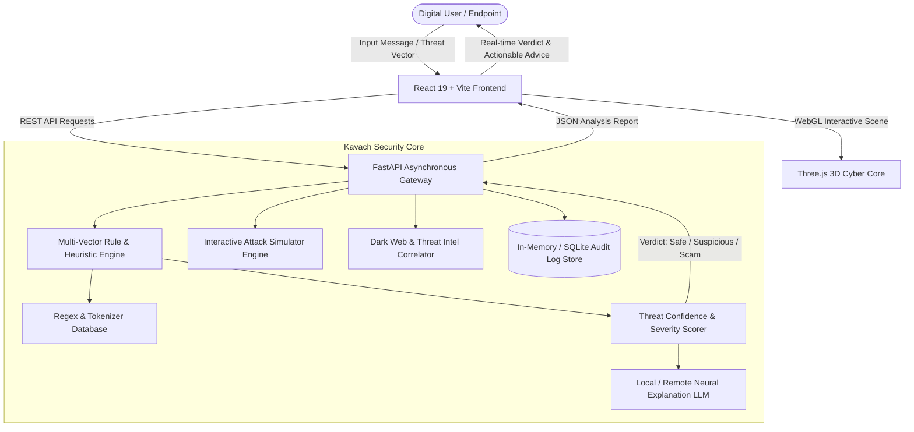
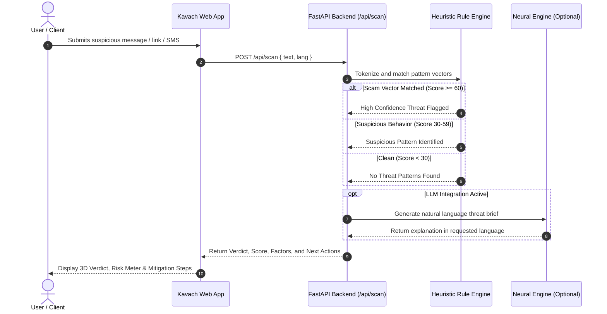
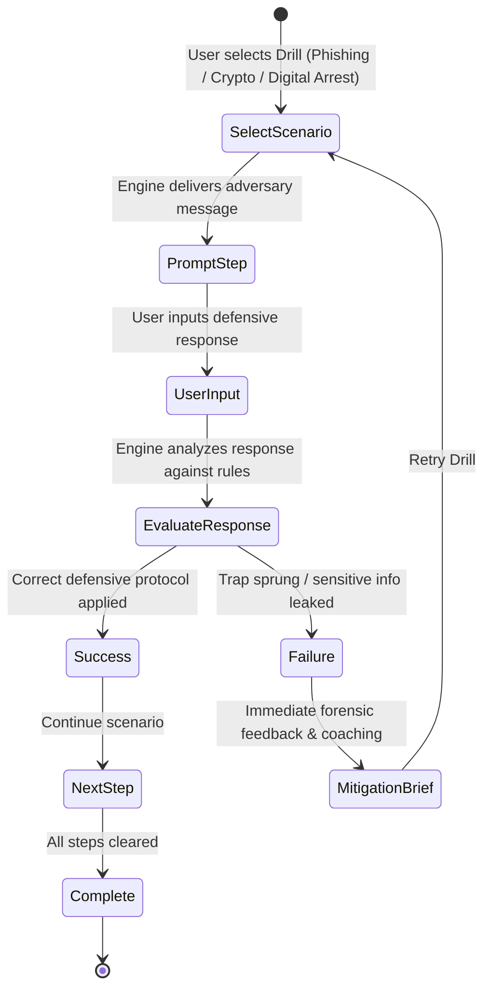

<div align="center">

# 🛡️ KAVACH (कवच)
### Next-Gen Autonomous Cyber Defense & Scam Intelligence Platform

[](https://opensource.org/licenses/MIT)
[](https://python.org)
[](https://fastapi.tiangolo.com)
[](https://react.dev)
[](https://www.typescriptlang.org)
[](https://threejs.org)
[](https://vitejs.dev)
[](https://www.docker.com)

**Kavach** (*"Shield"* in Sanskrit) is an enterprise-grade, multi-lingual fraud detection and cyber defense platform designed to neutralize social engineering attacks, digital arrest scams, phishing, and financial fraud across digital channels.

[Features](#-key-features) • [Architecture](#-system-architecture) • [Workflow Diagrams](#-workflow-diagrams) • [Quickstart](#-quickstart--installation) • [API Reference](#-api-documentation) • [License](#-license)

---

</div>

## 🌟 Key Features

| Feature | Description |
| :--- | :--- |
| **🧠 Multi-Vector Threat Core** | Real-time multi-dimensional pattern recognition detecting digital arrest threats, fake KYC, lottery bait, APK droppers, and courier imposter schemes. |
| **📡 Global Threat Radar** | Live zero-day scam feed, deep homoglyph/punycode link inspection, and QR/UPI debit trap analyzer. |
| **🎙️ Audio Deepfake Guard** | Real-time audio waveform visualizer and acoustic speech analyzer detecting AI voice cloning and coercive digital arrest calls. |
| **📱 Android APK Malware Sandbox** | Manifest privilege deconstructor, Accessibility hijacking detector, and Automated Transfer System (ATS) banking trojan profiler. |
| **🤖 Autonomous AI Counter-Baitalyzer** | Interactive honeypot persona bot designed to exhaust scammer human bandwidth and safely harvest suspect bank handles and phone numbers. |
| **📋 Legal Cybercrime Dossier Export** | Formats incident telemetry into structured, timestamped evidence dossiers ready for submission to 1930 and `cybercrime.gov.in`. |
| **🌐 10+ Language Support** | Full localization and phonetic scam tokenization in English, Hindi (हिन्दी), Marathi (मराठी), Spanish, French, German, Chinese, Japanese, Arabic, and Portuguese. |
| **🎮 Interactive Cyber Drills** | Gamified scenario simulator training users to identify and counter sophisticated phishing, authority impersonation, and wallet compromise attacks. |
| **🕶️ Dark Web & Breach Intel** | Real-time threat correlation checking compromised credentials, leaked hashes, and underground forum telemetry. |
| **📊 Forensic Audit Logging & SOC Metrics**| Complete event telemetry and loss-prevention analytics with local cryptographic state wipe capabilities. |

---

## 🏗️ System Architecture

Kavach is designed with a high-performance decoupled architecture: a lightning-fast asynchronous **FastAPI** backend coupled with a modern **React 19 + TypeScript + Vite** frontend.



---

## 🔄 Workflow Diagrams

### 1. Scam Ingestion & Detection Flow


---

### 2. Interactive Cyber Drill Loop


---

## 📁 Repository Structure

```
kavach/
├── app/                        # FastAPI Backend Service
│   ├── main.py                 # API Gateway, routes & endpoints
│   ├── rules.py                # Core scam heuristic engines & regex rules
│   └── models.py               # Pydantic schemas & data models
├── web/                        # Modern React 19 Frontend
│   ├── src/
│   │   ├── components/         # 3D CyberScene, Navigation, Cards
│   │   ├── pages/              # Scanner, Simulator, Logs, BreachMonitor
│   │   ├── i18n/               # 10-language internationalization
│   │   ├── App.tsx             # Root application shell & layout
│   │   └── index.css           # High-contrast black & white design system
│   ├── package.json            # Frontend dependencies (React 19, R3F, Lucide)
│   └── vite.config.ts          # Vite build configuration
├── eval/                       # Benchmark & Evaluation Suite
│   ├── dataset.json            # Curated real-world scam test cases
│   └── run.py                  # Accuracy, precision & recall evaluator
├── data/                       # Local threat signatures and seed datasets
├── tests/                      # Automated unit and integration tests
├── Dockerfile                  # Containerized deployment specification
├── render.yaml                 # One-click Render cloud infrastructure blueprint
├── requirements.txt            # Python dependencies (FastAPI, Uvicorn, Pytest)
├── LICENSE                     # Open-source MIT License
└── README.md                   # Comprehensive platform documentation
```

---

## ⚡ Quickstart & Installation

### Prerequisites
- **Python:** 3.10 or higher
- **Node.js:** 18.0 or higher
- **Git**

---

### 1. Clone the Repository
```bash
git clone https://github.com/Anurag-tech22/DEV1.git
cd DEV1
```

---

### 2. Backend Setup
```bash
# Create and activate virtual environment
python -m venv venv
# On Windows:
venv\Scripts\activate
# On Linux/macOS:
source venv/bin/activate

# Install backend dependencies
pip install -r requirements.txt

# Start FastAPI server on port 8000
uvicorn app.main:app --host 127.0.0.1 --port 8000 --reload
```
API documentation will be accessible at: `http://127.0.0.1:8000/docs`

---

### 3. Frontend Setup
```bash
# Navigate to web frontend directory
cd web

# Install dependencies
npm install

# Start Vite development server
npm run dev
```
Open your browser at `http://localhost:5173/`

---

### 4. Running with Docker
```bash
docker build -t kavach-security .
docker run -p 8000:8000 kavach-security
```

---

## 📡 API Documentation

### `POST /api/scan`
Evaluates an incoming message, SMS, email, or URL for fraud vectors.

**Request:**
```json
{
  "text": "URGENT: Electricity power will be disconnected tonight. Call officer at 9876543210 immediately.",
  "lang": "en"
}
```

**Response:**
```json
{
  "verdict": "scam",
  "score": 92,
  "type": "Utility Impersonation",
  "explain": "High-urgency utility shutoff scam demanding immediate contact via an unverified personal phone number.",
  "reasons": [
    "Fabricated urgency demanding immediate action under threat of disconnection",
    "Unverified personal telephone number provided instead of official utility contact",
    "Pressure tactic designed to induce panic"
  ],
  "actions": [
    "Do not call the provided telephone number",
    "Verify bill status directly on your electricity provider's official portal",
    "Report this number to the national cybercrime portal"
  ]
}
```

---

### `POST /api/drill`
Step-by-step interactive scenario trainer.

**Request:**
```json
{
  "scenario": "phishing",
  "step": 0
}
```

**Response:**
```json
{
  "line": "IT Support Notice: Urgent mandatory password reset required within 15 minutes at http://corp-reset-auth.net",
  "done": false
}
```

---

### `GET /api/history`
Returns recent threat evaluations and drill analytics.

---

### `GET /api/intel`
Retrieves curated real-time zero-day scam and threat campaigns across cyber crime vectors.

---

### `POST /api/url-inspect`
Deep forensic analysis of a URL for typosquatting, homoglyph character confusion, punycode spoofing, and risky TLDs.

---

### `POST /api/upi-inspect`
Analyzes UPI payment strings, VPAs, and QR payment intent links (`upi://pay`) for debit exploit traps.

---

### `POST /api/audio-inspect`
Inspects audio call transcripts and acoustic signals for AI voice cloning, authority coercion, and digital arrest intimidation.

---

### `POST /api/apk-inspect`
Evaluates Android APK package names and declared manifest permissions against mobile banking trojan signatures (e.g. Hydra, Godfather) and Accessibility hijacking.

---

### `POST /api/counter-scam`
Generates autonomous AI counter-baiting responses to waste scammer bandwidth and safely extract banking details, phone numbers, and payee VPAs.

---

### `GET /api/soc-stats`
Retrieves real-time Security Operations Center threat telemetry, prevention statistics, and vector distribution.

---

## 🧪 Testing & Evaluation

Run the automated evaluation suite against real-world scam benchmarks:
```bash
# Run pytest unit tests
pytest

# Run scam detection accuracy benchmark
python eval/run.py
```

---

## 🛡️ Security & Privacy Philosophy

- **Zero Data Harvesting:** Messages evaluated in local memory; no personally identifiable data is sent to external proprietary commercial AI models without user consent.
- **Self-Hostable:** Entirely decoupled from third-party vendor lock-in.
- **Air-Gappable:** Operates with high detection precision using pure deterministic rule trees even without an active internet connection.

---

## 📄 License

Distributed under the **MIT License**. See [`LICENSE`](./LICENSE) for full legal text and permissions.

---

<div align="center">
  <sub>Engineered by <strong>Anurag-tech22</strong> and the Kavach Cyber Defense Community. Stay safe in digital cyberspace.</sub>
</div>
